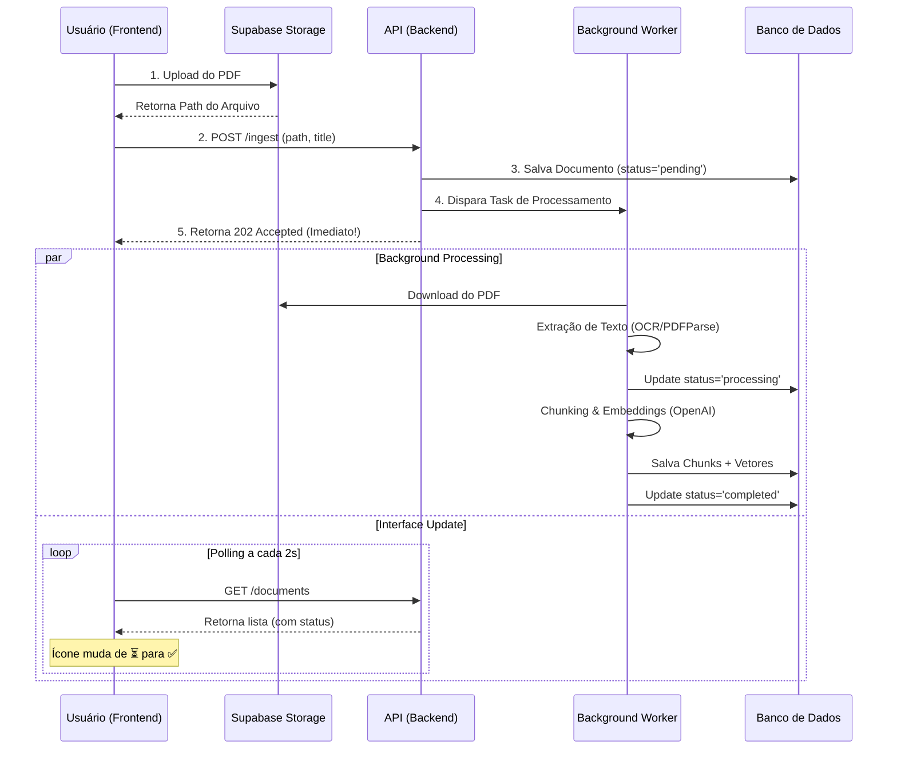

# 🧠 Fluxo da Aplicação (Showcase Architecture)

Este documento detalha o funcionamento da aplicação "Hub Agno", desde o primeiro acesso até a interação complexa com o Agente de IA.

---

## 1. Jornada do Usuário: Visão Geral

### **Fase 1: Acesso e Autenticação**
1.  **Usuário acessa a Home (`/`)**: O Next.js verifica se existe uma sessão válida do Supabase.
2.  **Middleware de Proteção**: Se não houver sessão, redireciona para Login via Supabase Auth (Magic Link ou Senha).
3.  **Dashboard**: Uma vez logado, o usuário vê seu "Knowledge Hub" pessoal. O sistema carrega apenas os documentos pertencentes ao `user_id` dele (garantido por RLS - Row Level Security).

---

### **Fase 2: "Ingestão Turbo" (Upload Assíncrono)**

Aqui acontece a mágica que permite 50+ usuários simultâneos sem travar o servidor.

**Por que isso brilha no portfólio?**
-   O usuário nunca fica esperando uma tela de loading travada.
-   O servidor liberou a conexão HTTP em milissegundos, pronto para atender o próximo usuário.

---

### **Fase 3: "Insight Stream" (Chat Inteligente)**

Quando o usuário faz uma pergunta, o sistema não apenas "cospe" a resposta, ele demonstra raciocínio.

1.  **Pergunta**: O usuário envia: *"Qual o prazo de validade do contrato?"*
2.  **Feedback Visual**: O Frontend exibe imediatamente o componente `ThinkingIndicator`.
3.  **O Raciocínio do Agent (Backend)**:
    *   **Intent Analysis**: O Agente Agno recebe a pergunta.
    *   **Tool Calling**: O Agente decide usar a tool `search_documents`.
    *   **Vector Search**: O banco Postgres busca os 5 trechos mais similares semanticamente usando `cosine distance`.
    *   **Synthesis**: O LLM (GPT-4o) lê os trechos e formula a resposta.
4.  **Resposta Interativa**:
    *   O Backend retorna a resposta textual **+ Metadados de Citação**.
    *   O Frontend renderiza a resposta.
    *   **Click-to-Cite**: Se a resposta diz *"Conforme contrato (pág 5)"*, isso é um link. Clicar nele abre o PDF split-screen exatamente na página 5.

---

## 2. Tecnologias Envolvidas (Under the hood)

### **Frontend (A "Cara")**
-   **Next.js 14**: Server Components para carregar dados iniciais rápido.
-   **Framer Motion**: Animações fluidas nas mensagens de chat e listas (nada "pula" na tela).
-   **Supabase Client**: Gerencia auth e realtime.

### **Backend (O "Cérebro")**
-   **FastAPI**: Framework Python assíncrono de alta performance.
-   **BackgroundTasks**: Gerenciador de fila leve e nativo (sem precisar de Redis/Celery complexos).
-   **Agno Framework**: Orquestrador do Agente, gerencia prompt engineering, tools e memória.
-   **SQLAlchemy + PgVector**: ORM que conversa com o Postgres e sabe lidar com vetores matemáticos (embeddings).

### **Banco de Dados (A "Memória")**
-   **Tabela `documents`**: Guarda metadados e o estado (`pending`, `processing`, `completed`).
-   **Tabela `chunks`**: Onde vivem os vetores. Cada PDF vira centenas de pedacinhos pesquisáveis.

---

## 3. Onde está o "Fator Uau"?

1.  **Zero Bloqueio**: Você pode subir 10 PDFs de uma vez e continuar navegando.
2.  **Transparência**: O usuário vê *o que* está acontecendo (uploading, processing, thinking).
3.  **Conexão Visual**: A resposta do chat não é texto morto; ela é uma ponte direta para o documento original (via clique na citação).
