# BrainHub Team

A multi-tenant document Q&A platform. Each user uploads PDFs, images, audio, and video into their private workspace, and the system extracts content, generates contextual vector embeddings, and answers questions over the corpus with cited sources via a streaming Corrective-RAG pipeline.

This README reflects the current implementation (commit `ccddc06` and forward): tenant isolation enforced at retrieval, libmagic MIME sniffing on upload, multi-provider LLM routing (Anthropic native or OpenRouter), Redis-backed `slowapi` rate limiting, and a hardened Docker topology behind Traefik.

## Overview

- Backend: FastAPI (Python 3.11) serving REST + Server-Sent Events (SSE), background ingestion via FastAPI `BackgroundTasks`.
- Frontend: Next.js 14 (App Router, TypeScript) with proxy routes that forward auth + SSE to the backend.
- Storage: local PostgreSQL 16 with the `pgvector` extension; uploaded files live on a Docker volume mounted at `/app/uploads`.
- Cache + rate limiter store: Redis 7.
- LLM: Anthropic Claude (Sonnet 4 for generation, Haiku 4.5 for cheap calls) or any OpenRouter model, selectable via `LLM_PROVIDER`.
- Embeddings: Voyage AI (`voyage-3-large` for documents, `voyage-3-lite` for queries, 1536 dimensions).
- Reranking: Cohere `rerank-v3.5` cross-encoder (optional; pipeline degrades to RRF order if absent).
- Multi-modal ingest: Google Gemini for images, audio, and video (PDFs use `pypdf`).
- Auth: local JWT (HS256) issued by `/auth/login` and `/auth/register`, validated per-request by a FastAPI dependency.

Every chunk row carries a `user_id`. Both `retrieve_documents` and `hybrid_search` require that `user_id` and apply it as a WHERE filter on `chunks` before RRF fusion or reranking — there is no cross-tenant leak even if the caller forgot to scope by document.

## Architecture

```mermaid
flowchart LR
    User([User browser])
    Next[Next.js 14<br/>App Router + proxy routes]
    API[FastAPI backend<br/>slowapi 30/min on hot routes]
    PG[(PostgreSQL 16<br/>pgvector HNSW + tsvector GIN)]
    Redis[(Redis 7<br/>embedding cache + rate limit store)]
    Voyage[Voyage AI<br/>voyage-3-large / voyage-3-lite]
    Cohere[Cohere<br/>rerank-v3.5]
    LLM[LLM provider<br/>Anthropic native SDK<br/>or OpenRouter via openai SDK]
    Gemini[Google Gemini<br/>image / audio / video]
    Disk[(Uploads volume<br/>/app/uploads)]

    User -->|HTTPS| Next
    Next -->|Bearer JWT, SSE passthrough| API

    subgraph Ingest path
        API -->|libmagic sniff + MIME allowlist| API
        API -->|"save_file: uploads_root/{user_id}/docs/{uuid4}.{ext}"| Disk
        API -->|BackgroundTask| Ingest[process_ingestion]
        Ingest -->|PDF| PyPDF[pypdf pages]
        Ingest -->|image / audio / video| Gemini
        PyPDF --> Chunker[tiktoken sentence chunker<br/>500 tokens, 100 overlap]
        Gemini --> Chunker
        Chunker -->|"per-chunk context (Haiku via llm_client)"| Enrich[Contextual enrichment]
        Enrich -->|enriched text| Voyage
        Voyage -->|1536-dim vectors| PG
        Ingest -->|"raw content + enriched_content"| PG
    end

    subgraph Chat path
        API -->|"retrieve_documents(user_id=...)"| Retriever[Multi-query<br/>3 variants via fast LLM]
        Retriever -->|cache-through| Redis
        Retriever -->|"embed_query (voyage-3-lite)"| Voyage
        Retriever -->|"hybrid_search(user_id=...)"| PG
        PG -->|"semantic + tsvector results"| RRF[Reciprocal Rank Fusion<br/>k=60]
        RRF --> Cohere
        Cohere --> Grader[Score threshold 0.7]
        Grader -->|good| Gen[Generator: chat_stream]
        Grader -->|"<50% pass"| Transform[Query rewrite + Tavily web search]
        Transform --> Gen
        Gen --> LLM
        LLM -->|token deltas| API
        API -->|"text/event-stream<br/>events: workflow, sources, chunk, done, error"| Next
        Next --> User
    end
```



The `app/core/llm_client.py` module is a thin shim: every call site (generator, retriever multi-query, chunker contextual enrichment, query transformer, PDF summary) goes through `chat_complete` / `chat_stream`, which routes to `anthropic.Anthropic().messages` or to `openai.OpenAI()` against `https://openrouter.ai/api/v1` based on `LLM_PROVIDER`.

## Tech stack

### Backend (`backend/requirements.txt`)

| Concern | Library / version |
|---|---|
| Web framework | `fastapi==0.115.0`, `uvicorn[standard]==0.30.0` |
| ORM / SQL | `sqlalchemy==2.0.32`, `psycopg2-binary==2.9.9` |
| Vector store binding | `pgvector==0.2.5` |
| Validation | `pydantic==2.8.2`, `pydantic-settings>=2.0.0` |
| Auth | `python-jose[cryptography]>=3.3.0`, `bcrypt>=4.0.0` |
| LLM SDKs | `anthropic>=0.40.0` (native) and `openai>=1.50.0` (OpenRouter path) |
| Embeddings | `voyageai>=0.3.0` |
| Reranker | `cohere>=5.0` |
| Tokenization for chunker | `tiktoken>=0.7.0` (`gpt-4o` encoder) |
| PDF | `pypdf==5.0.1` |
| MIME sniffing | `python-magic==0.4.27` (libmagic) |
| Multi-modal | `google-generativeai>=0.8.0` |
| Cache | `redis>=5.0` |
| Rate limiter | `slowapi>=0.1.9`, `limits>=3.0` (Redis backend) |
| Web search fallback | `tavily-python>=0.5.0` |
| Workflow (legacy, unused on SSE path) | `langgraph>=0.2.0`, `langchain-core>=0.3.0` |
| Optional observability | `langfuse==2.39.0` |

Python `3.11-slim` base image. The container creates a non-root `app` user with uid `10001`, mounts a tmpfs at `/tmp` and exports `PYTHONPYCACHEPREFIX=/tmp/pycache` to keep the writable layer empty.

### Frontend (`frontend/package.json`)

| Concern | Library / version |
|---|---|
| Framework | `next@14.2.3` (App Router) |
| Runtime | `react@18.2.0`, `react-dom@18.2.0` |
| Language | `typescript@^5.4` |
| Styling | `tailwindcss@^3.4.4`, `tailwindcss-animate`, `tailwind-merge`, `class-variance-authority`, `clsx` |
| UI primitives | `@radix-ui/react-avatar`, `@radix-ui/react-scroll-area`, `@radix-ui/react-slot`, `@radix-ui/react-tooltip` |
| Animations | `framer-motion@^12` |
| Icons | `lucide-react` |
| Markdown render | `react-markdown@^10` + `remark-gfm` |

Frontend is built and served by a multi-stage `node:20-alpine` image running as the non-root `nextjs` user.

### Database

PostgreSQL 16 with `vector`, `pgcrypto`, and `uuid-ossp` extensions. Tables (see `sql/init.sql`):

| Table | Notable columns |
|---|---|
| `users` | `id (uuid pk)`, `email unique`, `password_hash` (bcrypt), `is_active`, `created_at` |
| `documents` | `user_id` FK, `title`, `mime`, `storage_path`, `status`, `summary`, `chunk_count`, `meta jsonb`, `uploaded_at` |
| `chunks` | `user_id` FK, `document_id` FK CASCADE, `page`, `chunk_index`, `content`, `enriched_content`, `embedding vector(1536)`, `token_count`, `metadata jsonb`, `search_vector tsvector`, `created_at` |
| `threads` | `user_id` FK, `title`, `created_at`, `updated_at` |
| `messages` | `thread_id` FK CASCADE, `role`, `content`, `citations jsonb`, `sources uuid[]`, `created_at` |
| `semantic_cache` | reserved for future cross-query reuse, not wired in this build |

Indexes: HNSW on `chunks.embedding` (`vector_cosine_ops`, `m=16`, `ef_construction=64`), GIN on `chunks.search_vector`, B-trees on every FK and on `documents.uploaded_at DESC`. A trigger keeps `search_vector` in sync from `content || ' ' || enriched_content`.

The `chunks.text -> content` rename and the new `enriched_content`, `token_count`, `metadata`, `created_at` columns landed in `ccddc06`. `messages.meta` was replaced with the typed `citations jsonb` plus a `sources uuid[]` array of cited chunk ids.

## Ingest pipeline (multi-modal)

Two entry points, both rate-limited to `30/minute` per IP via `slowapi`:

- `POST /upload` (multipart): the file is read into memory and capped at `MAX_FILE_SIZE` (default 20 MB).
- `POST /ingest`: legacy JSON entry point that accepts a previously-saved `storage_path`; preserved for the older client flow.

`POST /upload` is the canonical path. Steps inside `app/api/routes/documents.py`:

1. **Auth.** `require_user` decodes the bearer JWT and yields `user_id`.
2. **MIME allowlist.** `_sniff_mime` calls `magic.from_buffer(data, mime=True)` (libmagic). The sniffed MIME must be a key of `ALLOWED_MIMES`:
   - `application/pdf`
   - `image/png`, `image/jpeg`, `image/gif`, `image/webp`
   - `audio/mpeg`, `audio/mp3`, `audio/wav`, `audio/x-wav`, `audio/webm`
   - `video/mp4`, `video/webm`
3. **Declared content-type cross-check.** If the client sent a `Content-Type` and that value is also in the allowlist, its extension set must match the sniffed MIME's extension set; otherwise the upload is rejected with `415`.
4. **Path-safe save.** `save_file(user_id, sniffed_mime, data)` builds the relative path `{user_id}/docs/{uuid4()}{ext}` — the original filename is **discarded**. The absolute write target is then verified by comparing `os.path.realpath(target)` against `os.path.realpath(uploads_path)`; anything that resolves outside the uploads root is refused. `get_file`, `get_file_abspath`, and `delete_file` all share the same `_resolve_in_uploads` defense.
5. **Document row.** A `documents` row is inserted with `status='pending'` and the relative `storage_path`.
6. **Background ingest.** `BackgroundTasks` queues `process_ingestion(doc_id, user_id, storage_path)` and the endpoint returns `202`-style `{document_id, status: "pending"}` immediately.

Inside `process_ingestion`:

- For `application/pdf`, `extract_pages_from_pdf` produces a list of page strings (whitespace-collapsed). `chunk_document_pages` then runs the tiktoken-based sentence-boundary splitter at `chunk_size=500` tokens with `chunk_overlap=100`.
- For images / audio / video, `app/core/ingestion/multimodal.py` uploads the bytes to the Gemini Files API, polls until processing completes, and asks `gemini-2.5-flash-preview-04-17` to describe / transcribe. The returned text is then chunked with the same `chunk_text` splitter.
- For PDFs, `enrich_chunks_with_context` calls the fast model (Haiku via `llm_client.chat_complete`) once per chunk to generate 2-3 sentences of document-level context, which is prepended before embedding (Anthropic's contextual retrieval). Non-PDF flows currently embed the raw chunk and write `enriched_content = NULL`.
- Embedding is batched (`batch_size=64`) through `voyage-3-large` with `input_type="document"` and stored together with the raw `content` and the prepended `enriched_content` in `chunks`.
- A 2-3 sentence document summary is generated by the fast model and saved to `documents.summary`. Document status is moved to `completed`; on any exception it is moved to `failed` with the error in `meta->error`.

## Chat pipeline

`POST /chat` (`30/minute` via `slowapi`) returns `text/event-stream`. The handler in `app/api/routes/chat.py`:

1. **Validation.** `validate_input` runs the heuristic injection regex set (11 patterns) and the length floor / ceiling.
2. **Thread ownership.** If `thread_id` is provided, `validate_thread_ownership` asserts `threads.user_id == user_id` (otherwise `403`); else a new thread row is created.
3. **History.** Up to 20 prior messages from the thread are loaded.
4. **Save user message.** Before retrieval starts, the user's message is persisted with `role='user'`.
5. **Retrieve.** `retrieve_documents(question, user_id=..., document_ids=..., top_k=5)`:
   - `generate_multi_queries` asks the fast LLM (via `llm_client.chat_complete`) for `multi_query_count=3` variants; `[question] + variants` are all searched.
   - For each query: `get_query_embedding` (cache-through against Redis with key `emb:{sha256(query)}`, TTL 3600 s) -> `voyage-3-lite` if miss.
   - `hybrid_search(query_embedding, query_text, user_id=..., top_k=15, document_ids=...)` runs two SQL queries against `chunks` joined to `documents`:
     - Semantic: `1 - (embedding <=> :qvec) >= 0.1`, ordered by cosine distance, LIMIT 15.
     - Keyword: `search_vector @@ plainto_tsquery('english', :query_text)`, ordered by `ts_rank` DESC, LIMIT 15.
   - Both branches carry `AND c.user_id = CAST(:user_id AS uuid)` and an optional `AND c.document_id = ANY(...)` filter, **before** RRF.
   - RRF merge with `k=60`. `enriched_content` (when present) is the snippet shown.
   - The deduplicated candidate pool (best score per chunk id) is reranked by Cohere `rerank-v3.5` if `COHERE_API_KEY` is set; otherwise the top RRF candidates are returned in place.
6. **Grade.** `grade_documents` keeps chunks whose `relevance_score >= 0.7`. If less than half pass, `needs_web_search=True` is signalled (and `transform_query` plus an optional Tavily call are attempted). When everything is filtered out, the top 2 by score are kept as a safety net.
7. **Sources event.** Citations (`document_id`, `document_title`, `page`, `snippet[:200]`) are emitted as a `sources` SSE event; "web" results from Tavily are excluded from citations.
8. **Generate.** `stream_answer` builds the system prompt + history + `Context from documents:\n\n... \n\nQuestion: ...` user turn and calls `llm_client.chat_stream` with the configured `generation_model`. Tokens are emitted as `chunk` SSE events.
9. **Finalize.** A `done` event with `{thread_id}` is sent. In the `finally` block the assistant message and its citations are written to `messages` (`citations` jsonb). Errors emit an `error` SSE event.

SSE event schema (matches `frontend/lib/types.ts`):

| Event | Payload |
|---|---|
| `workflow` | `WorkflowStep[]` (`step`, `status`, `details`) |
| `sources` | `Citation[]` |
| `chunk` | `string` (token delta) |
| `done` | `{thread_id: string}` |
| `error` | `{message: string}` |

## Tenant isolation and security

- **Per-row `user_id` on `documents` and `chunks`.** `retrieve_documents` and `hybrid_search` both **require** `user_id` as a positional / keyword arg. Both SQL branches inside `hybrid_search` filter by `c.user_id = CAST(:user_id AS uuid)` before RRF — there is no codepath that returns another tenant's chunk.
- **Document delete (`DELETE /documents/{id}`).** Ownership-checked SELECT followed by a DELETE; chunks vanish via FK CASCADE, the on-disk file is removed via `delete_file`.
- **Thread delete (`DELETE /threads/{id}`, LGPD).** Same pattern — ownership-checked SELECT, then DELETE. `messages` rows go via FK CASCADE.
- **Document preview.** `GET /document/{id}/preview` returns `404` (not `403`) when the document exists but belongs to someone else, hiding existence.
- **Path traversal defense.** All disk I/O routes through `_resolve_in_uploads`, which compares `os.path.realpath(uploads_root / storage_path)` against `os.path.realpath(uploads_root)` and refuses paths that escape (or symlinks that point out).
- **Filename hygiene.** Stored filenames are `uuid4() + ext_from_validated_mime`; the original client filename is discarded, eliminating filename-based traversal and metadata leakage.
- **MIME enforcement.** libmagic sniff + allowlist + declared/sniffed agreement check (see Ingest pipeline).
- **Auth.** Local JWT (HS256, 60-minute expiry by default), bcrypt password hash, registration enforces a 12-character minimum (raised from 6 in `ccddc06`).
- **Rate limit.** `slowapi.Limiter` with `storage_uri=settings.redis_url` and `key_func=get_remote_address` is wired on `app.state.limiter`. `30/minute` is applied to `POST /upload`, `POST /ingest`, and `POST /chat`. `headers_enabled=False` because the SSE response is hand-rolled.
- **Prompt injection heuristic.** 11 regex patterns (`ignore previous instructions`, `you are now`, `system prompt`, `jailbreak`, `DAN mode`, etc.) plus length bounds (`>=3`, `<=10000`).
- **OpenAPI surface.** `/docs`, `/redoc`, `/openapi.json` are exposed only when `DEBUG=true`. `/healthz` is the canonical health endpoint and is excluded from the schema.
- **Container hardening.** `security_opt: no-new-privileges:true`, `cap_drop: [ALL]`, `tmpfs: /tmp`, non-root uid 10001 in the backend image. Secrets come from the `backend/.env` file plus `JWT_SECRET` and `DB_PASSWORD` from the host environment.
- **Edge.** Traefik fronts both services and attaches the security-headers middleware (HSTS preload, `frameDeny`, `contentTypeNosniff`, `referrerPolicy=strict-origin-when-cross-origin`, `browserXssFilter`) plus the shared `global-ratelimit@file` and `strip-server-header@file` middlewares.

## Local development

Prerequisites: Docker 24+, Docker Compose v2.

1. Copy `backend/.env.example` to `backend/.env`. At minimum set `JWT_SECRET`, `ANTHROPIC_API_KEY` (or switch to OpenRouter), `VOYAGE_API_KEY`. Set `DB_PASSWORD` and `JWT_SECRET` in the shell or in a project-level `.env` consumed by Compose.
2. Run the stack:

   ```bash
   docker compose up -d --build
   ```

   This brings up `postgres` (with `sql/init.sql` auto-applied via the entrypoint), `redis`, `backend`, and `frontend`. The backend waits on the `pg_isready` and `redis-cli ping` healthchecks.
3. Visit the frontend at `http://localhost:3000` (or the configured Traefik host). Register a user via `POST /auth/register`; passwords need at least 12 characters.
4. To iterate without Docker: `cd backend && python3 -m venv .venv && source .venv/bin/activate && pip install -r requirements.txt && uvicorn app.main:app --reload --port 8000`. The frontend uses `cd frontend && npm install && npm run dev`. You still need a reachable Postgres with `pgvector` and a Redis instance, and `sql/init.sql` must be applied manually.

## Deployment

The repository ships a production-ready `docker-compose.yml` for the `pgdev.com.br` Traefik environment. The four services are:

| Service | Image | Notes |
|---|---|---|
| `postgres` | `pgvector/pgvector:pg16` | Volume-backed, `init.sql` auto-applied. On `internal` only. |
| `redis` | `redis:7-alpine` | Internal-only; backs both the embedding cache and the slowapi limiter. |
| `backend` | built from `backend/Dockerfile` | Non-root uid 10001, `cap_drop: [ALL]`, `no-new-privileges`, `tmpfs:/tmp`. Healthcheck on `GET /healthz`. Mounts the `uploads` volume at `/app/uploads`. |
| `frontend` | built from `frontend/Dockerfile` | Non-root `nextjs` user, `next start` on port 3000. |

Both `backend` and `frontend` are attached to the external `proxy` network and routed by Traefik:

- Frontend host: `group-documents.pgdev.com.br`
- Backend host: `group-documents-api.pgdev.com.br`

Each router pulls in three middlewares:

1. `<service>-security@docker` — HSTS (`stsSeconds=31536000`, includeSubdomains, preload, force), `frameDeny`, `contentTypeNosniff`, `browserXssFilter`, `referrerPolicy=strict-origin-when-cross-origin`.
2. `global-ratelimit@file` — defined at the Traefik static-config layer, applied to every public route.
3. `strip-server-header@file` — also defined at the Traefik file layer; removes the `Server` response header.

TLS is via Let's Encrypt (`certresolver=letsencrypt`). The frontend `Dockerfile` takes `NEXT_PUBLIC_API_URL` as a build-arg so the static bundle can address the backend at the public hostname.

Operational checklist (see also `/root/.claude/CLAUDE.md`):

- DNS A records for both subdomains pointed at the host.
- `JWT_SECRET` and `DB_PASSWORD` set in the shell environment used by `docker compose up`.
- `backend/.env` populated with API keys and `chmod 600`.
- Verify HSTS / X-Frame / X-Content headers: `curl -sI https://group-documents.pgdev.com.br | grep -iE 'strict-transport|x-frame|x-content'`.
- Verify TLS chain: `echo | openssl s_client -connect group-documents-api.pgdev.com.br:443 2>/dev/null | openssl x509 -noout -subject -issuer`.

## Environment variables

### Backend (`backend/.env`, plus values injected by `docker-compose.yml`)

| Variable | Required | Default | Purpose |
|---|---|---|---|
| `DATABASE_URL` | yes | `postgresql+asyncpg://...` | PostgreSQL DSN. The engine factory rewrites `+asyncpg` to `psycopg2` for the synchronous SQLAlchemy engine. |
| `JWT_SECRET` | yes | — | HS256 signing key. |
| `JWT_ALGORITHM` | no | `HS256` | |
| `JWT_ACCESS_TOKEN_EXPIRE_MINUTES` | no | `60` | |
| `UPLOADS_PATH` | no | `/app/uploads` | Filesystem root; volume-mounted in Compose. |
| `LLM_PROVIDER` | no | `anthropic` | `anthropic` (native SDK) or `openrouter` (OpenAI-compatible). |
| `ANTHROPIC_API_KEY` | when `LLM_PROVIDER=anthropic` | — | |
| `OPENROUTER_API_KEY` | when `LLM_PROVIDER=openrouter` | — | |
| `OPENROUTER_BASE_URL` | no | `https://openrouter.ai/api/v1` | |
| `GENERATION_MODEL` | no | `claude-sonnet-4-20250514` | Provider-appropriate id (e.g. `anthropic/claude-sonnet-4` on OpenRouter). |
| `FAST_MODEL` | no | `claude-haiku-4-5-20251001` | Used by multi-query, contextual enrichment, query transform, summary. |
| `VOYAGE_API_KEY` | yes | — | Voyage AI. |
| `VOYAGE_DOC_MODEL` | no | `voyage-3-large` | |
| `VOYAGE_QUERY_MODEL` | no | `voyage-3-lite` | |
| `EMBEDDING_DIMENSIONS` | no | `1536` | Must match the `vector(N)` schema. |
| `COHERE_API_KEY` | no | — | If unset, reranking is skipped. |
| `COHERE_RERANK_MODEL` | no | `rerank-v3.5` | |
| `ENABLE_RERANKING` | no | `true` | |
| `CHUNK_SIZE` / `CHUNK_OVERLAP` | no | `500` / `100` | Token counts via tiktoken `gpt-4o` encoder. |
| `SIMILARITY_TOP_K` | no | `5` | |
| `SEARCH_CANDIDATES_MULTIPLIER` | no | `3` | Hybrid search prefetch = `top_k * multiplier`. |
| `RELEVANCE_THRESHOLD` | no | `0.7` | Grader cutoff. |
| `RRF_K` | no | `60` | Reciprocal Rank Fusion constant. |
| `MULTI_QUERY_COUNT` | no | `3` | |
| `REDIS_URL` | yes (in Compose) | `redis://localhost:6379` | Embedding cache + slowapi storage. |
| `EMBEDDING_CACHE_TTL` | no | `3600` | |
| `TAVILY_API_KEY` | no | — | If set, Corrective branch will call Tavily. |
| `GOOGLE_API_KEY` | no | — | Required for image / audio / video ingest. |
| `GEMINI_MODEL` | no | `gemini-2.5-flash-preview-04-17` | |
| `RATE_LIMIT_REQUESTS` / `RATE_LIMIT_WINDOW_SECONDS` | no | `30` / `60` | Currently informational; the active limit is set in code as `30/minute`. |
| `ENABLE_INPUT_GUARDRAILS` | no | `true` | Toggles the injection regex set. |
| `LANGFUSE_ENABLED` / `LANGFUSE_*` | no | `false` / — | Optional observability. |
| `MAX_FILE_SIZE` | no | `20 * 1024 * 1024` | 20 MB upload cap. |
| `CORS_ORIGINS` | no | `http://localhost:3000` | Comma-separated list. |
| `DEBUG` | no | `false` | Setting `true` re-enables `/docs`, `/redoc`, `/openapi.json`. |

### Frontend (`frontend/.env.local` or build-arg)

| Variable | Required | Notes |
|---|---|---|
| `NEXT_PUBLIC_API_URL` | yes | Public origin of the FastAPI backend; baked at build time. |
